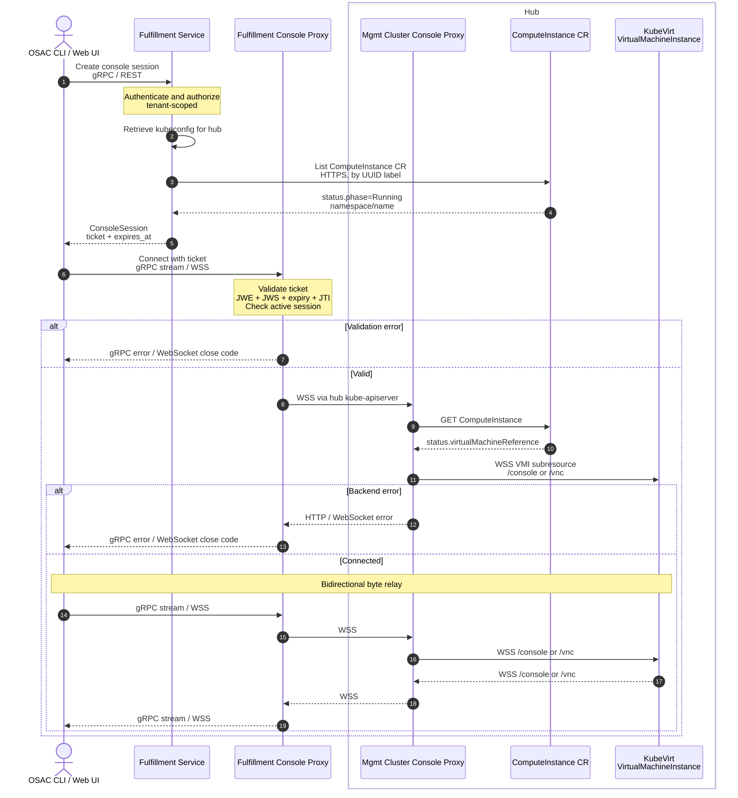

# Console Access

Console access provides serial and VNC connectivity to running compute instances through the `osac` CLI and web UI. It is useful for troubleshooting, setup, and recovery when normal network access such as SSH is unavailable.

Access is mediated by the fulfillment service and console proxies, which enforce authentication, authorization, and tenant boundaries. Users never connect directly to the management cluster.

Serial and VNC share the same session, ticket, and proxy infrastructure. Serial carries terminal I/O, while VNC carries RFB traffic. The CLI uses gRPC streaming, and the web UI uses WebSocket.

## Architecture

Console access involves four components:



### Fulfillment Service

The fulfillment service authenticates the user, validates the target compute instance, and issues an encrypted ticket.

### Fulfillment Console Proxy

The fulfillment console proxy runs as its own Kubernetes Deployment (`fulfillment-console-proxy`), separate from the main fulfillment service Deployments. It uses the same container image but runs the `console-proxy` subcommand:

```bash
fulfillment-service start console-proxy
```

It validates the console ticket, manages the active session, connects to the management cluster console proxy, and relays console traffic. It relies solely on the ticket for authentication and has no database dependency.

It exposes:

- A gRPC bidirectional stream for CLI clients.
- A WebSocket endpoint for browser clients.

### Management Cluster Console Proxy

The management cluster console proxy runs on each hub cluster as a separate Deployment alongside the `osac-operator`. It uses the same container image but runs the `console-proxy` binary.

It has its own ServiceAccount, Service, TLS certificate, and `APIService` registration. It registers as a Kubernetes aggregated API server under `console.osac.openshift.io/v1alpha1`. Requests reach it through the hub kube-apiserver.

The proxy resolves the OSAC `ComputeInstance` to a KubeVirt `VirtualMachineInstance` and connects to the `console` or `vnc` subresource.

### KubeVirt

KubeVirt provides the serial console and VNC endpoints on each VMI.

## Session Flow

A console connection has four steps:

### 1. Create a Ticket

The client calls `ConsoleSessions.Create` (gRPC) or sends a REST request:

```http
POST /api/fulfillment/v1/console_sessions
Authorization: Bearer <user-jwt>
Content-Type: application/json
```

`ConsoleSession` is a protobuf API object defined in `console_service.proto`.

Request body:

```json
{
  "resource_type": "CONSOLE_RESOURCE_TYPE_COMPUTE_INSTANCE",
  "resource_id": "<compute-instance-uuid>",
  "type": "CONSOLE_TYPE_SERIAL",
  "client_id": "<optional-uuid>"
}
```

| Field | Required | Values | Description |
|-------|----------|--------|-------------|
| `resource_type` | Yes | `CONSOLE_RESOURCE_TYPE_COMPUTE_INSTANCE` | Only compute instances are supported. `CONSOLE_RESOURCE_TYPE_HOST` exists but returns `Unimplemented`. |
| `resource_id` | Yes | UUID string | Compute instance ID. |
| `type` | Yes | `CONSOLE_TYPE_SERIAL`, `CONSOLE_TYPE_VNC` | Serial for text terminal, VNC for graphical console. |
| `client_id` | No | UUID string or empty | Stable identifier for the client process. See [client_id and Stale Session Eviction](#client_id-and-stale-session-eviction). |

Response body:

```json
{
  "resource_type": "CONSOLE_RESOURCE_TYPE_COMPUTE_INSTANCE",
  "resource_id": "<uuid>",
  "type": "CONSOLE_TYPE_SERIAL",
  "client_id": "<uuid>",
  "ticket": "eyJhbGciOiJSU0EtT0FFUC0yNTYi...",
  "expires_at": "2026-06-10T12:00:30Z"
}
```

| Field | Description |
|-------|-------------|
| `ticket` | Opaque encrypted token (nested JWE+JWS). Single-use. Expires in 30 seconds. Use it immediately. Treat as opaque. |
| `expires_at` | Ticket expiration timestamp. |

The fulfillment service validates the request as follows:

1. Authenticates and authorizes the user.
2. Resolves the compute instance through the tenant-scoped database layer.
3. Verifies that the instance is in `RUNNING` state and assigned to a hub.
4. Reads the `ComputeInstance` CR from the hub.
5. Verifies that the CR is in `Running` phase.
6. Constructs the management cluster console proxy WebSocket URL.
7. Extracts the hub bearer token from the hub kubeconfig.
8. Creates an encrypted, signed, single-use ticket.

### 2. Connect to the Console Proxy

The client opens a gRPC stream or a WebSocket connection to the fulfillment console proxy and presents the ticket.

The proxy:

1. Decrypts and validates the ticket.
2. Rejects consumed tickets.
3. Registers the session.
4. Connects to the backend URL in the ticket.
5. Relays console traffic until the connection closes or the session timeout expires.

### 3. Resolve the VMI

The management cluster console proxy reads `ComputeInstance.status.virtualMachineReference` to obtain the namespace and name of the KubeVirt VMI. It then connects to the console or VNC subresource on the VM cluster:

```text
wss://<vm-cluster>/apis/subresources.kubevirt.io/v1/namespaces/<namespace>/virtualmachineinstances/<name>/{console|vnc}
```

### 4. Relay Console Traffic

Once all hops connect, traffic flows bidirectionally through the proxy chain.

## Console Tickets

### Ticket Structure

A ticket is a nested JWT:

1. Inner: JWS signed with RS256.
2. Outer: JWE using RSA-OAEP-256 key encryption, A256GCM content encryption, and DEFLATE compression.

The ticket carries user identity (subject), `client_id`, console type, backend WebSocket URL and bearer token, and standard JWT metadata: issuer, audience (`fulfillment-console-proxy`), JTI, and expiration.

The backend token is carried only inside the encrypted ticket.

### Ticket Validation

The fulfillment console proxy validates a ticket as follows:

1. Decrypts the JWE with its private key.
2. Verifies the JWS signature against the issuer's JWKS.
3. Validates issuer, audience, and expiration with a 5-second clock-skew tolerance.
4. Checks the JTI against an in-memory set of consumed tickets.

Each ticket can be consumed only once. A replayed ticket is rejected.

### Key Rotation

The fulfillment service publishes its signing public key at the issuer's `.well-known/jwks.json` endpoint. The console proxy hot-reloads its decryption key when the key file changes and refreshes its JWKS cache when it encounters an unknown key ID. Both components pick up new keys automatically.

## Client Transports

The fulfillment console proxy exposes two transports: gRPC and WebSocket. Both use the same session and relay logic.

### gRPC

CLI clients use the bidirectional `ConsoleProxy.Connect` RPC.

The ticket is sent in gRPC metadata:

```text
Authorization: Bearer <ticket>
```

During setup, the server sends `ConsoleStatus` messages:

- `CONNECTING` before dialing the backend
- `CONNECTED` after the backend connection succeeds
- `ERROR` if setup fails

Console data is carried in:

- `ConsoleInput` from client to server
- `ConsoleOutput` from server to client

#### Serial CLI

```bash
osac console serial computeinstance <name-or-id>
```

The CLI sets the terminal to raw mode. All terminal control comes from the VM serial port.

Disconnect: `Ctrl+]` or `Enter` then `~.`

| Flag | Default | Description |
|------|---------|-------------|
| `--timeout` | `30m` | Client-side session limit |

#### VNC CLI

```bash
osac console vnc computeinstance <name-or-id>
```

The CLI auto-detects a VNC viewer on the local system, launches it, and bridges the viewer connection to the gRPC console stream.

Viewer search order on Linux: `remote-viewer`, `vncviewer`, `remmina`.

Viewer search order on macOS: TigerVNC Viewer.app, TigerVNC legacy versioned .app, Chicken.app, `vncviewer`, `remote-viewer`.

If viewer detection fails, the CLI exits with an error. Use `--viewer` to specify a viewer binary directly.

With `--proxy-only`, the CLI skips viewer detection, starts the local TCP proxy, and prints the listener address (e.g., `VNC proxy listening on 127.0.0.1:54321`). Connect any VNC viewer to this address. The CLI bridges the first incoming connection to the console stream.

| Flag | Default | Description |
|------|---------|-------------|
| `--timeout` | `30m` | Client-side session limit |
| `--proxy-only` | `false` | Run the proxy and wait for an external viewer |
| `--port` | `0` | Local TCP port (`0` = random) |
| `--viewer` | auto-detect | VNC viewer binary |

### WebSocket

The WebSocket endpoint runs on a separate HTTP listener (default port `8090`), separate from the main API port.

```http
GET /api/fulfillment/v1/console_sessions/connect
```

The connection is a binary WebSocket. Raw console data only.

#### Authentication

| Method | Header / Cookie | Empty `Origin` | Non-empty `Origin` | Use case |
|--------|-----------------|----------------|--------------------|---------|
| Bearer token | `Authorization: Bearer <ticket>` | Allowed | Checked against allow-list | Non-browser clients |
| Cookie | `console-ticket=<ticket>` | Rejected (403) | Checked against allow-list | Browser UI |

The standard browser `WebSocket` API cannot set request headers, so browser clients use the cookie. The allow-list is configured with `--console-cors-allowed-origins`.

#### Subprotocol

The server supports the `binary` subprotocol. If the client offers `binary`, the server selects it. The server also accepts connections that omit the subprotocol header. The relay always uses binary WebSocket framing.

#### Upgrade and error reporting

The server upgrades the WebSocket before it validates the ticket. Setup failures are reported as WebSocket close frames (see [Error Semantics](#error-semantics)) so browser JavaScript can read the close code and reason.

#### Serial Web UI

Use a terminal emulator such as xterm.js. The server sends bytes from the VM serial port. The client sends keystrokes.

#### VNC Web UI

Use an RFB/VNC client such as noVNC. The WebSocket payload is an RFB stream.

To check readiness, query the compute instance status or attempt to create a ticket.

## Session Lifecycle

### Session Identity and Concurrency

The proxy identifies sessions by backend URI. Only one active session per console endpoint is allowed within a console-proxy process. With the current single-replica deployment, this is effectively deployment-wide. Session state is stored in memory and includes the user, `client_id`, and session start time.

Serial and VNC use different backend endpoints. A serial session and a VNC session for the same compute instance can coexist.

A second connection to the same endpoint is rejected unless it qualifies for session replacement (see [`client_id` and Stale Session Eviction](#client_id-and-stale-session-eviction)).

Rejection codes:

- gRPC: `FailedPrecondition`
- WebSocket: close code `4409`

### `client_id` and Stale Session Eviction

A client can provide a UUID `client_id` when creating a ticket.

If a new connection has the same user and `client_id` as an existing session on the same endpoint, the proxy cancels the old session and replaces it.

The CLI generates one `client_id` per command invocation and reuses it across retries within that process. Retries from the same process can replace their own stale session.

A restarted CLI process generates a new `client_id` and cannot replace a session from the previous process. The old session remains until it times out or the proxy detects the dead connection.

### Session Timeout

Default: `30m`. Configure with `--console-session-timeout`.

The deadline is set once when the session starts.

When the timeout expires, the proxy closes both sides of the relay. The gRPC handler returns status OK. The CLI sees a clean stream closure and exits without retrying.

The CLI has a separate `--timeout` flag (default `30m`). Both timers default to 30 minutes, but the client timer starts earlier (before ticket creation), so it typically expires first. If the server timeout is shorter than the client timeout, the session ends with a silent clean closure.

`--timeout 0` disables the client-side timer. The server timeout still applies.

The ticket TTL (30 seconds) and the session timeout are separate.

### Disconnect and Retry

A session ends when:

- The client disconnects.
- The user sends an escape sequence (serial) or closes the viewer (VNC).
- The backend closes the connection.
- The VM stops.
- The session timeout expires.
- The console proxy shuts down.

When either side of the relay closes, the proxy closes the other side and removes the session.

The CLI retries on unexpected errors with exponential backoff:

- Initial delay: 1 second
- Maximum delay: 30 seconds
- Maximum consecutive failures: 5

Each retry requests a fresh ticket. A successful connection resets the failure counter.

Permanent errors (exit immediately): `PermissionDenied`, `NotFound`, `Unauthenticated`, `FailedPrecondition`, `InvalidArgument`, `Unimplemented`.

Transient errors (retried): `Unavailable` and all others.

The CLI exits on a clean stream closure.

## Authentication, Authorization, and Security

### User Authentication

`ConsoleSessions.Create` requires a valid Keycloak identity token through the standard fulfillment-service authentication stack.

The console proxy validates only the ticket.

The CLI uses separate gRPC connections for:

- Ticket creation (with Keycloak credentials).
- Console streaming (with the console ticket only).

### Tenant and Resource Authorization

Ticket creation uses the standard fulfillment-service authorization path. The compute instance is resolved through the tenant-scoped database layer. A user can only get tickets for resources in their own tenant.

### Management Cluster Authentication and Authorization

The management cluster console proxy is an aggregated Kubernetes API server. The hub kube-apiserver provides authentication through front-proxy headers. The proxy performs authorization through `SubjectAccessReview`.

### Backend Credentials

The fulfillment console proxy authenticates to the management cluster with the hub bearer token from the encrypted ticket.

The management cluster console proxy connects to KubeVirt with credentials for the selected VM cluster:

- `local` mode: in-cluster ServiceAccount credentials
- `remote` mode: credentials from the kubeconfig Secret

### Additional Security Controls

- **Single-use tickets**: Consumed JTIs are recorded in memory. Reuse is rejected.
- **Origin validation**: WebSocket requests are checked against the allow-list. Cookie-based authentication requires a non-empty `Origin`.
- **Kubeconfig hardening**: `exec` and `auth-provider` plugins are stripped from kubeconfigs loaded from Secrets.
- **Credential-safe logging**: Backend tokens are excluded from logs. Query strings are removed from logged console HTTP request paths.

## Error Semantics

### Ticket Creation

| Condition | gRPC status | HTTP status |
|-----------|-------------|------------:|
| Missing resource ID | `InvalidArgument` | 400 |
| Unsupported resource type | `Unimplemented` | 501 |
| Missing or unsupported console type | `InvalidArgument` | 400 |
| Invalid `client_id` | `InvalidArgument` | 400 |
| Compute instance not running | `FailedPrecondition` | 400 |
| Instance not assigned to a hub | `FailedPrecondition` | 400 |
| Instance not found on the hub | `FailedPrecondition` | 400 |
| Instance not yet running on the hub | `FailedPrecondition` | 400 |

### gRPC Console Proxy

| Condition | gRPC status |
|-----------|-------------|
| Missing or malformed ticket | `Unauthenticated` |
| Expired or replayed ticket | `Unauthenticated` |
| Session already active | `FailedPrecondition` |
| Backend unavailable | `Unavailable` |

### WebSocket Console Proxy

Pre-upgrade (HTTP):

| Condition | HTTP status |
|-----------|------------:|
| Cookie authentication without `Origin` | 403 |
| Disallowed `Origin` | 403 |

Post-upgrade (WebSocket close frames):

| Condition | Close code | Meaning | Reason |
|-----------|----------:|---------|--------|
| Missing, invalid, or expired ticket | 3000 | Unauthorized | `unauthorized` |
| Console already in use | 4409 | Private application conflict code | `console session already active` |
| Backend connection failed | 1014 | Bad Gateway | `failed to connect to console backend` |

### Management Cluster Console Proxy

| Condition | HTTP status |
|-----------|------------:|
| Unauthenticated | 401 |
| Unauthorized | 403 |
| `ComputeInstance` not found | 404 |
| VM reference unavailable | 503 |
| VM cluster configuration resolution failed | 503 |
| Connection to KubeVirt failed | 503 |
| KubeVirt returned an error | Upstream status forwarded |

## Guest Requirements

VNC works with any guest OS.

Serial access requires the guest OS to present a login prompt on the virtual serial device. Linux images with systemd commonly need to enable `serial-getty@ttyS0`.

CSP-provided templates should include serial console configuration. Omit default passwords from templates. Users must set credentials per VM.

### Example VM

Save as `cloud-init.yaml`:

```yaml
#cloud-config
password: <your-password>
chpasswd:
  expire: false
runcmd:
  - systemctl enable serial-getty@ttyS0.service
  - systemctl start serial-getty@ttyS0.service
```

Create a compute instance:

```bash
osac create computeinstance \
  --catalog-item <catalog-item-id> \
  --name my-vm \
  --boot-disk-size 20 \
  --boot-disk-storage-tier standard \
  --disk-image fedora \
  --run-strategy Always \
  -p cloud_init_config="$(base64 < cloud-init.yaml | tr -d '\n')"
```

After the instance reaches `RUNNING`, connect:

```bash
osac console serial computeinstance my-vm
```

## Deployment and Configuration

### Fulfillment Console Proxy

The Helm chart deploys the fulfillment service and console proxy as separate Deployments. The console proxy has its own Service.

Console-specific configuration:

| Flag | Required | Default | Description |
|------|----------|---------|-------------|
| `--token-issuer` | Yes | | JWKS issuer URL for ticket verification |
| `--token-decryption-key` | Yes | | Private key for JWE decryption |
| `--console-cors-allowed-origins` | Yes | | Allowed WebSocket origins |
| `--console-session-timeout` | No | `30m` | Maximum server-side session duration |
| `--console-client-ping-interval` | No | `15s` | Client-facing WebSocket ping interval |
| `--console-client-pong-timeout` | No | `10s` | Client-facing pong timeout |
| `--console-backend-ping-interval` | No | `15s` | Backend-facing WebSocket ping interval |
| `--console-backend-pong-timeout` | No | `10s` | Backend-facing pong timeout |
| `--ca-file` | No | | CA bundle for backend TLS (may be repeated) |

Setting a ping interval to `0` disables that ping loop.

Listener defaults:

| Listener | Default |
|----------|---------|
| gRPC | `localhost:8000` |
| Console HTTP/WebSocket | `:8090` |
| Metrics | `localhost:8002` |

### Envoy Routing

The Helm chart provides dedicated console routes with:

```yaml
timeout: 0s
idle_timeout: 1800s
```

The WebSocket route is:

```text
/api/fulfillment/v1/console_sessions/connect
```

It forwards to `console-proxy-ws` and is exposed on the external API listener.

The gRPC route matches:

```text
/osac.public.*ConsoleProxy/Connect
```

It forwards to `console-proxy-grpc` and is present on both external and internal API listeners.

These routes must appear before the catch-all routes.

For custom Envoy configurations:

```yaml
- name: console-ws
  match:
    path: /api/fulfillment/v1/console_sessions/connect
  route:
    cluster: console-proxy-ws
    timeout: 0s
    idle_timeout: 1800s

- name: console-proxy-grpc
  match:
    safe_regex:
      regex: /osac\.public\..*ConsoleProxy/Connect
  route:
    cluster: console-proxy-grpc
    timeout: 0s
    idle_timeout: 1800s
```

### Network Requirements

Network path:

```text
Client -> OpenShift Route -> Envoy -> Console Proxy -> Hub kube-apiserver -> Management Cluster Console Proxy -> KubeVirt
```

Required connectivity:

| From | To | Protocol | Purpose |
|------|-----|----------|---------|
| Client | Fulfillment API | HTTPS, gRPC or REST | Ticket creation |
| Client | Console proxy route | HTTPS, gRPC or WebSocket | Console stream |
| Console proxy | Hub Kubernetes API | HTTPS and WebSocket | Backend relay |
| Management cluster console proxy | KubeVirt API | HTTPS and WebSocket | VMI console subresource |

### Management Cluster Console Proxy RBAC

The `osac-operator` Helm chart configures RBAC based on the VM-cluster mode.

All modes:

```yaml
- apiGroups: [osac.openshift.io]
  resources: [computeinstances]
  verbs: [get, list]
```

`local` and `auto` modes add:

```yaml
- apiGroups: [subresources.kubevirt.io]
  resources:
    - virtualmachineinstances/console
    - virtualmachineinstances/vnc
  verbs: [get]
```

`auto` and `remote` modes add `get` and `list` on Secrets (scoped to the release namespace) for remote kubeconfig resolution. In the default deployment, ComputeInstances reside in the release namespace.

`remote` mode omits local KubeVirt permissions. The proxy uses credentials from a remote kubeconfig.

The proxy ServiceAccount is bound to `system:auth-delegator`.

The chart uses ClusterRoles where access spans multiple namespaces.

### Management Cluster Routing

The management cluster console proxy supports three VM-cluster modes:

| Mode | Behavior |
|------|----------|
| `local` | Use the proxy's in-cluster configuration |
| `remote` | Load a kubeconfig from a labeled Secret in the `ComputeInstance` namespace |
| `auto` (default) | Try remote first, fall back to local when a Secret is absent |

Configure with `--vm-cluster-mode` or `OSAC_CONSOLE_PROXY_VM_CLUSTER_MODE`.

In `auto` mode, fallback to local occurs only when the Secret is absent. Other remote errors (malformed kubeconfig, API failures) are returned directly.

### KubeVirt Requirements

Serial access requires `AutoattachSerialConsole` to be enabled on the VMI. VNC access requires `AutoattachGraphicsDevice` to be enabled. Both default to enabled.

### Keepalive, Health, and Metrics

The console proxy sends WebSocket pings on both sides of the relay (default: every 15 seconds, 10-second pong timeout). Client-facing and backend-facing intervals are configurable independently.

The gRPC health service starts as `NOT_SERVING` and changes to `SERVING` after the JWKS key cache is ready.

Prometheus metrics: total connections, active connections, connection duration. Labeled by console type.

## Troubleshooting

### Important Log Messages

Ticket creation:

| Level | Message | Meaning |
|-------|---------|---------|
| INFO | `Console session ticket created` | Ticket was issued |
| WARN | `Running compute instance not found on hub` | DB state is running but the hub CR is missing |
| WARN | `Compute instance is not running on hub` | Hub CR exists but is in a different phase |

Fulfillment console proxy:

| Level | Message | Meaning |
|-------|---------|---------|
| INFO | `Console ticket opened` | Ticket was validated |
| INFO | `Connecting to console` | Opening backend WebSocket |
| INFO | `Connected to console` | Backend connection succeeded |
| DEBUG | `Console relay ended` | Relay completed |
| WARN | `Console proxy error` | Relay ended with an error |
| ERROR | `Failed to connect backend` | Backend WebSocket failed |
| ERROR | `Failed to accept WebSocket connection` | Client WebSocket upgrade failed |
| ERROR | `Failed to send error status` | gRPC status could not be sent |
| DEBUG | `Failed to complete WS close handshake` | WebSocket close handshake failed |
| ERROR | `Console handler panicked` | HTTP handler panic recovery triggered |
| INFO | `Console request started` | HTTP request received |
| INFO | `Console request completed` | HTTP request finished |

Session lifecycle:

| Level | Message | Meaning |
|-------|---------|---------|
| INFO | `Opening console session` | Session registered |
| INFO | `Evicting stale console session` | Matching user and `client_id` replaced an existing session |
| INFO | `Cancelling console session` | Session cancellation started |
| INFO | `Closing console session` | Session ended |
| INFO | `Ping timeout, tearing down connection` | WebSocket keepalive failed |

### Common Problems

| Symptom | Likely cause | Resolution |
|---------|--------------|------------|
| Ticket creation: instance not running | Provisioning incomplete | Wait for `RUNNING` state |
| Ticket creation: instance not found on hub | `ComputeInstance` CR missing | Check controller reconciliation |
| Ticket creation: no VM reference | `status.virtualMachineReference` empty | Check controller reconciliation and VM creation |
| Serial console shows no output | Guest serial console unconfigured | Configure serial-getty in the guest image or cloud-init |
| Serial login unavailable | Guest credentials unset | Configure credentials via cloud-init |
| Session ends after about 30 minutes | Server-side timeout expired | Increase `--console-session-timeout` |
| `console session already active` | Another session or a stale session owns the endpoint | Wait for timeout or retry from the same CLI process |
| Backend returns 403 | Missing RBAC for console proxy or KubeVirt subresources | Verify ClusterRole and ClusterRoleBinding on the hub |
| Connection terminated by ingress | Console Envoy routes missing or incorrect | Verify `timeout: 0s` and dedicated routes |
| Console proxy fails at startup | Required flags missing | Verify `--token-issuer`, `--token-decryption-key`, `--console-cors-allowed-origins` |

## Capacity and Scaling

Each active session uses:

- One client-facing gRPC stream or WebSocket connection
- One backend WebSocket connection to the hub
- In-memory session state
- Relay and keepalive goroutines

The console proxy runs as a single replica (hardcoded `replicas: 1` in the Helm chart).

Session state and JTI tracking are process-local. Horizontal scaling requires shared session and ticket-consumption state, or another coordination mechanism that preserves the same guarantees.

## Current Limitations

- **Bare metal consoles**: `CONSOLE_RESOURCE_TYPE_HOST` exists in the API. Requests return `Unimplemented`.
- **Fixed session deadline**: The server-side timeout is a fixed deadline.
- **Session limits**: Limits are per-endpoint only.
- **Session recording**: Console payload is relayed without recording.
- **Audit storage**: Session events appear in operational logs only.
- **Hub client caching**: A new controller-runtime client is built per console connection.
- **Serial terminal resize**: Resize messages are unsupported. VNC handles framebuffer sizing through the RFB protocol.
